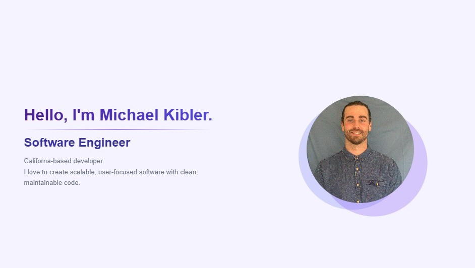
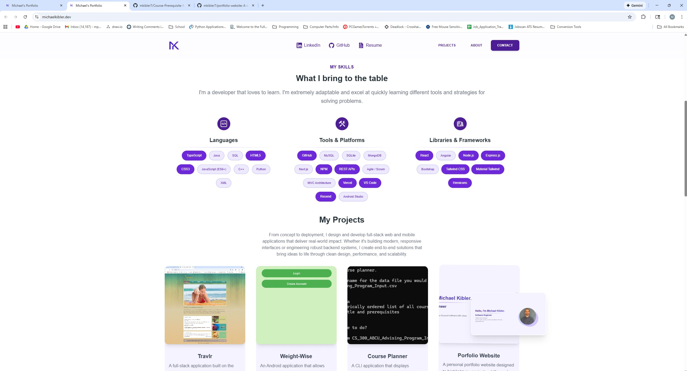
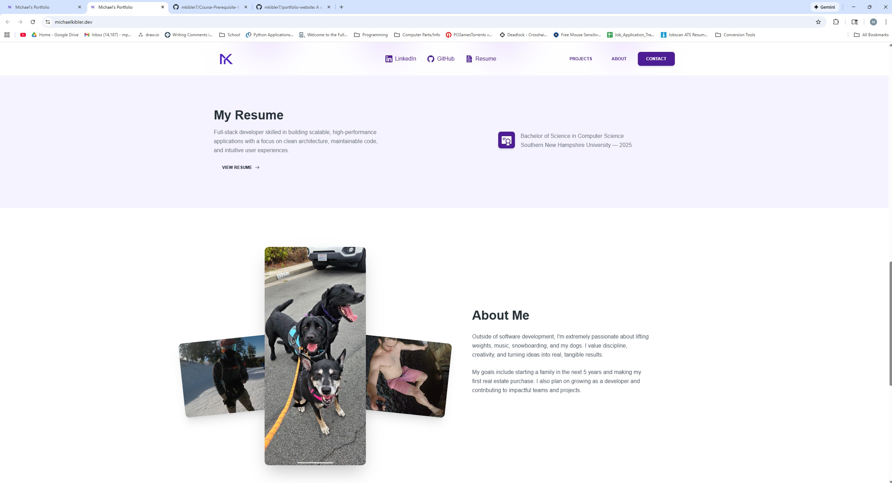
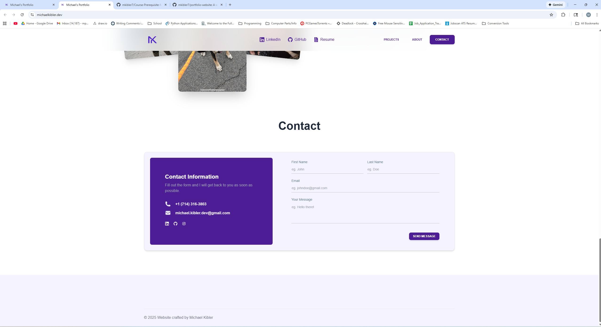

# Personal Developer Portfolio

A modern, responsive personal portfolio built with **Next.js**, **React**, **Tailwind CSS**, and **TypeScript**.  
This site showcases my software development work, skills, resume, and professional branding. It's fully optimized for both web and mobile, and deployed on Vercel.

This project serves as my primary professional portfolio and includes:  
- A clean, custom UI with smooth animations  
- A skills and projects showcase  
- A functional contact form powered by Resend  
- An organized, responsive layout designed to be fast and accessible 

## Features

- ✅ Fully responsive modern layout  
- ✅ Home/Hero section with animation and branding  
- ✅ Interactive **Skills** section with hover-based highlighting  
- ✅ **Projects** section with images, tech badges, and animations  
- ✅ Contact form using **Resend API**  
- ✅ Mobile-optimized navbar and menu  
- ✅ Deployed on **Vercel** with custom domain  

## Tech Stack

- **Next.js 14**
- **React**
- **TypeScript**
- **Tailwind CSS**
- **Resend API** (contact form)
- **Vercel Hosting**

## What I Learned

- Deploying a full Next.js application to Vercel with custom domains  
- Handling API routes with `route.ts` in the App Router  
- Managing component structure and reusable UI sections  
- Using Tailwind + Material Tailwind for consistent design and animations  
- Debugging image pathing, mobile layouts, and routing issues  
- Setting up DNS records for deployment + email providers  
- Organizing a professional, developer-grade portfolio layout 

### Screenshots

#### Hero Section

#### Skills Section

#### About Section

#### Contact Section

#### Resume Inline-PDF Viewer

## Live Demo
**https://michaelkibler.dev**

## Running Locally
1. Clone this repository:
   https://github.com/mkibler7/portfolio-website
2. cd portfolio-website  
3. npm install 
4. npm run dev
5. Open browser of choice and visit: http://localhost:3000
   

## Author/Contact Info

Created by **Michael Kibler**  
[LinkedIn](https://www.linkedin.com/in/michael-kibler-11369519b/) | [Email](mailto:michael.kibler.dev@gmail.com)
